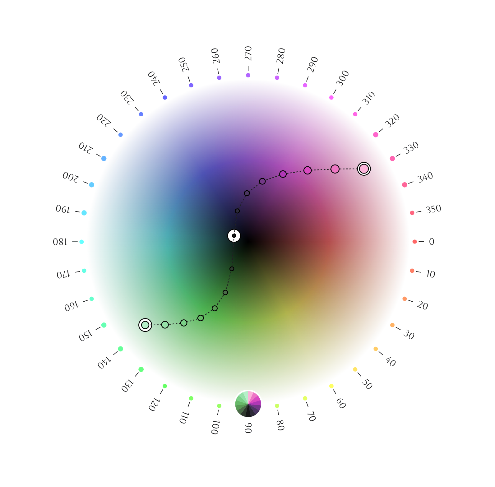

<h1><a href="https://meodai.github.io/poline/"></a></h1>

## Esoteric Color palette Generator Mico-Lib

"**poline**" is an enigmatic color palette generator, that harnesses the mystical witchcraft of polar coordinates. Its methodology, defying conventional color science, is steeped in the esoteric knowledge of the early 20th century. This magical technology defies explanation, drawing lines between anchors to produce visually striking and otherworldly palettes. It is an indispensable tool for the modern generative sorcerer, and a delight for the eye.




## Summoning
The use of "**Poline**" begins with the invocation of its command, which can be performed with or without arguments. If called without, the tool will generate a mesmerizing palette featuring two randomly selected **anchors.**
On the other hand, one can choose to provide their own **anchor** points, represented as a list of **hsl** values, for a more personal touch. The power to shape and mold the colors lies in your hands."

```js
new Poline({
  anchorColors: [
    [309, 0.72, 0.80],
    [67, 0.32, 0.08],
    //...
  ],
});
```

## Points
The magic of "**Poline**" is revealed through its technique of drawing lines between anchor points. The richness of the palette is determined by the number of **points**, with each connection producing a unique color.

Increasing the number of **points** will yield an even greater array of colors. By default, four points are used, but this can easily be adjusted through the 'numPoints' property on your Poline instance, as demonstrated in the code example.

```js
new Poline({
  numPoints: 6,
});
```

The resulting palette is a product of points multiplied by the number of anchor pairs. It can be changed after initialization by setting the **numPoints** property on your "**Poline**" instance.

## Anchors

At the heart of "**Poline**" lies the concept of **anchors**, the fixed points that serve as the foundation for the creation of color palettes. **Anchors** are represented as a **list of hsl** values, which consist of three components: **hue** \[0…360\], **saturation** \[0…1\], and **lightness** \[0…1\].

The choice is yours, whether to provide your own anchor points during initialization or to allow "**Poline**" to generate a random selection for you by omitting the 'anchorColors' argument. The versatility of Poline extends "**Poline**" its initial setup, as you can also add anchors to your palette at any time using the '**addAnchor**' method. This method accepts either a **color** as HSL array values or an array of **X, Y, Z** coordinates, further expanding the possibilities of your color creation.

```js
poline.addAnchorPoint({
  color: [100, 0.91, 0.80]
});

// or

poline.addAnchorPoint({
  xyz: [0.43, 0.89, 0.91]
});
```

## Updating Anchors

With this feature, you have the power to fine-tune your palette and make adjustments as your creative vision evolves. So whether you are looking to make subtle changes or bold alterations, "**Poline**" is always ready to help you achieve your desired result.

The ability to update existing anchors is made possible through the '**updateAnchorPoint**' method. This method accepts the **reference to the anchor** you wish to modify and either a color in the form of **HSL** representation or an **XYZ** position array.

```js
poline.updateAnchorPoint({
  point: poline.anchorPoints[0],
  color: [286, 0.22, 0.22]
});
```

## Position Function

The **position function** in "**Poline**" plays a crucial role in determining the **distribution of colors between the anchors**. It works similar to easing functions and can be imported from the "**Poline**" module.

A position function is a mathematical function that maps a value **between 0 and 1** to another value between 0 and 1. By definition the same position function for all axes "**Poline**" will draw a straight line between the anchors. The chosen function will determine the distribution of colors between the anchors.

```js
import {
Poline, positionFunctions
} from 'poline';

new Poline({
  positionFunction: 
    positionFunctions.linearPosition,
});
```

If none is provided, "**Poline**" will use the default function, which is a sinusoidal function.
The following position functions are available and can be included by importing the **positionFunctions** object from the "**Poline**" module:

- linearPosition
- exponentialPosition
- quadraticPosition
- cubicPosition
- quarticPosition
- sinusoidalPosition **(default)**
- asinusoidalPosition
- arcPosition

## Arcs
By defining **different position functions for each axis**, you can control the distribution of colors along each axis (**positionFunctionX**, **positionFunctionY**, **positionFunctionZ**). This will draw different arcs and create a diverse range of color palettes.

```js
new Poline({
  positionFunctionX: 
    positionFunctions.sinusoidalPosition,
  positionFunctionY: 
    positionFunctions.quadraticPosition,
  positionFunctionZ: 
    positionFunctions.linearPosition,
});
```

## Palette


By default, the palette is not a closed loop. This means that the last color generated is not the same as the first color. If you want the palette to be a closed loop, you can set the **closedLoop** argument to true.

```js
poline.closedLoop = true;

```

It is also possible to close the loop after the fact by setting **poline.closedLoop = true|false**.

## Hue Shifting

With the power of hue shifting, "**Poline**" provides yet another level of customization. This feature allows you to **shift the hue** of the colors generated by a certain amount, giving you the ability to animate your palette or create similar color combinations with different hues."

"**poline**" supports hue shifting. This means that the hue of the colors will be shifted by a certain amount. This can be useful if you want to animate the palette or generate a palette that looks similar to your current palette but using different hues.

```js
poline.shiftHue(1);
```
The amount is a int or float between -Infinity and Infinity. It will permanently shift the hue of all colors in the palette.

## Closest Anchor

In some situations, you might want to know which anchor is closest to a certain position or color. This method is used in the visualizer to highlight to select the closest anchor on click.

```js
poline.getClosestAnchorPoint(
  {xyz: [x, y, null], maxDistance: .1}
)
```

The **maxDistance** argument is optional and will return null if the closest anchor is further away than the maxDistance.
Any of the **xyz** or **hsl** components can be null. If they are **null**, they will be ignored.

## Color List

The '**poline**' instance returns all colors as an array of **hsl** arrays or alternatively as an array of **CSS** strings.
```js
poline.colors
poline.colorsCSS
```

## Remove Anchors

To remove an anchor, you can use the **removeAnchorPoint** method. It either takes an **anchor** reference or an **index** as an argument.
```js
poline.removeAnchorPoint({
  point: poline.anchorPoints[
    poline.anchorPoints.length - 1
  ]
});
  // or
poline.removeAnchorPoint({
  index: poline.anchorPoints.length - 1
});
```

## Color Model

To keep the library as lightweight as possible, "**poline**" only supports the **hsl** color model out of the box. However, it is easily possible to use other color models by using a library like [culori](https://culorijs.org/api/).

```js
import {Poline} from "poline";
import {formatHex} from "culori";
const poline = new Poline(/** options */);

const OKHslColors = [...poline.colors].map(
  c => formatHex({ 
    mode: 'okhsl', 
    {
      h: c.hsl[0], 
      s: c.hsl[1], 
      l: c.hsl[2]}
  })
);
const LCHColors = [...poline.colors].map(
  c => formatHex({ 
    mode: 'lch', 
    { 
      h: hsl[0],
      c: hsl[1] * 51.484,
      l: hsl[2] * 100,  
    }
  })
);
```

## Installation

"**poline**" is available as an [npm package](https://www.npmjs.com/package/poline). Alternatively you can clone it on [GitHub](https://github.com/meodai/poline).

```js
npm install poline
```
You can also use the [unpkg CDN](https://unpkg.com/poline) to include the library in your project.
I recommend using the **mjs** version of the library. This will allow you to use the **import** syntax. But you can also use the **umd** version if you prefer to use the **script** tag.

```html
import { 
  Poline 
} from 'https://unpkg.com/poline?module'
```

## License

And thus, the tome of "**poline**" has been written. Its mystical powers, steeped in the arcane knowledge of the ancients, now reside within these pages. May this compendium serve you in your quest for the ultimate color palette.

The project is [MIT licensed](https://github.com/meodai/poline/blob/main/LICENSE) and open source. If you find any bugs or have any suggestions please open an issue on [GitHub]().

Inspired and created with the blessing of [Anatoly Zenkov](https://anatolyzenkov.com/)
